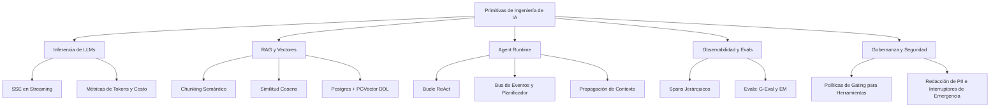

# Laboratorio de Ingeniería de IA (AI Engineering Lab): De Primitivas a Producción

[](https://www.python.org)
[](LICENSE)
[](./scripts/local_check.sh)
[](./docker-compose.yml)

Bienvenido al **AI Engineering Lab**. Este repositorio está diseñado bajo una filosofía práctica y de primeros principios (*bottom-up*), inspirada en el estilo de enseñanza de Andrej Karpathy. Aquí implementamos las primitivas centrales de la Ingeniería de IA **desde cero**, utilizando código Python limpio, legible y sin dependencias externas.

Al construir estos sistemas desde los fundamentos básicos, desmitificamos los frameworks de agentes modernos, comprendemos la mecánica profunda de la recuperación de información y aprendemos a construir aplicaciones de IA seguras, gobernadas y altamente observables.

---

## 🏛️ Estructura del Vault de Conocimiento (Estilo Karpathy)

Este repositorio está estructurado siguiendo la metodología de **LLM Wiki / Obsidian Vault** propuesta por Andrej Karpathy para bases de conocimiento mantenidas por Inteligencia Artificial:

*   **[CLAUDE.md](./CLAUDE.md)**: El manual de rieles de comportamiento en la raíz que instruye a los agentes de IA sobre cómo mantener este repositorio, sus esquemas de carpetas y guías de codificación.
*   **[/raw](./raw/)**: Bandeja de entrada inmutable. Contiene transcripciones, requisitos e información bruta (e.g., [intake_sources.md](./raw/intake_sources.md)).
*   **[/wiki](./wiki/)**: Compilación estructurada. Artículos técnicos y guías de aprendizaje enlazados y conectados con el código de producción.

---

## 📖 Guías de Aprendizaje (Estilo Karpathy)

Para entender a fondo la base teórica y las implicaciones arquitectónicas de cada primitivo implementado, hemos desarrollado una serie de guías detalladas escritas bajo una filosofía de primeros principios:

1. [00. Introducción y Filosofía Arquitectónica (CTO)](./wiki/00_introduccion.md): La visión de transformación organizacional, bucles de aprendizaje y la elección pragmática de PostgreSQL + PGVector.
2. [01. Inferencia de LLMs y Protocolos de Red](./wiki/01_llm_inference.md): Conexión HTTP cruda, Server-Sent Events (SSE), estimación de costos y tokenización.
3. [02. RAG y PGVector](./wiki/02_rag_postgres_pgvector.md): Álgebra lineal en Python puro, sliding window, semantic chunking y evaluación del motor de búsqueda (Hit Rate & MRR).
4. [03. Anatomía de un Agent Runtime](./wiki/03_agent_runtime.md): Bucles ReAct, buses de eventos asíncronos, schedulers, short/long-term memory engines y OpenTelemetry Context Propagation.
5. [04. Observabilidad y Evals](./wiki/04_observability_and_evals.md): Trazabilidad jerárquica de spans, compatibilidad con esquemas Langsmith/Langfuse, Exact Match, Token F1, G-Eval y versionado.
6. [05. Gobernanza y Seguridad de Agentes](./wiki/05_governance_and_security.md): Políticas de gating a nivel de ejecución (ToolGater), RBAC, máscara de PII, límites presupuestarios diarios y kill switches.
7. [06. El Ecosistema de Frameworks](./wiki/06_framework_ecosystem.md): La evolución comercial de LangChain, alternativas ligeras (Mastra, PydanticAI, CrewAI, OpenAI Agents SDK, Gollem, Flue, pi) y matriz de decisión construir vs. adoptar.

---

## 🗺️ El Paisaje de la Ingeniería de IA

La Ingeniería de IA es un campo multidisciplinar que abarca la interacción con modelos, la recuperación de datos, el diseño de sistemas y las operaciones. Este laboratorio está organizado en torno a temas centrales:



### 1. LLMs e Inferencia Central
La interacción con modelos (GPT, Claude, Gemini, Qwen, Llama, etc.) es la base. La ingeniería de prompts, las salidas estructuradas en JSON, los parsers de streaming y la estimación de tokens/costo son conceptos clave implementados en [01_llm_inference_scratch.py](./00_primitives_scratch/01_llm_inference_scratch.py).

### 2. Generación Aumentada por Recuperación (RAG)
El RAG empresarial pragmático empieza con simplicidad. En el 95% de los casos, **PostgreSQL + PGVector** es la opción óptima porque simplifica la operación, evita problemas de sincronización de datos y escala a millones de vectores. Las bases de datos vectoriales dedicadas solo deben introducirse cuando el volumen, las latencias de sub-milisegundo o capacidades de indexación híbrida compleja lo exijan estrictamente. Cubrimos segmentación semántica (*semantic chunking*), distancia coseno, filtrado de metadatos y calidad de recuperación en [02_rag_postgres_pgvector.py](./00_primitives_scratch/02_rag_postgres_pgvector.py).

### 3. Runtimes de Agentes y Arquitecturas
Los agentes son sistemas de software que razonan, planifican y actúan. Un runtime de agente completo requiere coordinar estado, herramientas, contexto, planificadores y eventos asíncronos. Analizamos estos patrones (incluyendo arquitecturas dirigidas por eventos y propagación de contexto) en [03_agent_runtime_scratch.py](./00_primitives_scratch/03_agent_runtime_scratch.py).

### 4. Observabilidad y Evaluaciones (Evals)
No se puede mejorar lo que no se mide. La observabilidad implica rastrear árboles de ejecución (spans y ejecuciones anidadas). Las evaluaciones implican puntuar las salidas de forma programática. Construimos una micro-librería de rastreo y evaluadores en [04_observability_and_evals.py](./00_primitives_scratch/04_observability_and_evals.py).

### 5. Gobernanza, Seguridad y Operaciones
En producción, los agentes requieren guardarraíles. Implementamos políticas de gating en tiempo de ejecución, limpieza de PII, límites de tasa (*rate limiters*) e interruptores de emergencia a nivel del sistema en [05_governance_and_security.py](./00_primitives_scratch/05_governance_and_security.py).

---

## 🛠️ El Ecosistema de Frameworks (Agent Harnesses)

Al migrar de código personalizado a frameworks comerciales, resulta útil comprender la evolución histórica y las alternativas actuales.

### La Evolución de la Suite LangChain
Los arneses de agentes modernos en producción han evolucionado para manejar estados y operaciones cada vez más complejos:

$$\text{LangChain (Chains)} \longrightarrow \text{LangGraph (Grafos y Ciclos)} \longrightarrow \text{LangSmith (Depuración)} \longrightarrow \text{LangServe (Despliegue de APIs)} \longrightarrow \text{LangMem (Memoria Persistente)} \longrightarrow \text{LangFuse (Telemetría)} $$

*   **LangChain**: Construcción simple de pipelines lineales.
*   **LangGraph**: Grafos de estado que permiten ciclos, bucles y coordinación multi-agente.
*   **LangSmith**: Plataforma de depuración, pruebas y trazabilidad para apps de LLMs.
*   **LangServe**: Expone componentes de LangChain como APIs REST usando FastAPI.
*   **LangMem**: Servicio de memoria especializado para persistir estado de agentes a largo plazo.
*   **LangFuse**: Plataforma de código abierto para trazabilidad, evaluaciones y gestión de prompts.

### Frameworks Ligeros Modernos
Si deseas evitar abstracciones pesadas, existen diversas alternativas emergentes:
*   [Mastra](https://github.com/mastra-ai/mastra): Framework TypeScript ligero y tipado para construir agentes con flujos de trabajo e integraciones.
*   [PydanticAI](https://github.com/pydantic/pydantic-ai): Framework nativo en Python enfocado en seguridad de tipos, inyección de dependencias y código agnóstico al modelo.
*   [OpenAI Agents SDK](https://github.com/openai/openai-agents-python): Librería minimalista para construir agentes nativos sobre las APIs de OpenAI.
*   [Deep Agents](https://github.com/langchain-ai/deepagents): Arnés de agentes autónomos con pilas incluidas ("batteries-included") desarrollado por LangChain que simplifica el desarrollo e integración de herramientas y memoria sobre LangGraph.
*   [CrewAI](https://github.com/crewaiinc/crewai): Orquestación de agentes colaborativos y especializados con juegos de rol.
*   [Gollem](https://github.com/fugue-labs/gollem): Runtime de agentes enfocado en máquinas de estado deterministas.
*   [Flue](https://github.com/withastro/flue): Integraciones nativas web para renderizado y visualización ligera del estado de agentes.
*   [pi](https://github.com/earendil-works/pi/): Scripts de agentes embebidos y ultra-ligeros.

---

## 💡 Lo que pocos comentan ("Poca gente sabe hablar de...")

Construir un chatbot simple es fácil. Construir sistemas de IA de producción es excepcionalmente difícil. La industria suele pasar por alto retos de ingeniería críticos:

| Dimensión | La Cruda Realidad | Nuestra Implementación desde Cero |
| :--- | :--- | :--- |
| **Calidad de Recuperación** | La búsqueda no es solo coincidencia de palabras clave. Se debe medir Hit Rate y MRR. | Calculado programáticamente en [02_rag_postgres_pgvector.py](./00_primitives_scratch/02_rag_postgres_pgvector.py) |
| **Estrategias de Chunking** | Los divisores de caracteres ingenuos rompen el contexto semántico. Necesitas ventanas deslizables o límites semánticos. | Segmentación por similitud de oraciones en [02_rag_postgres_pgvector.py](./00_primitives_scratch/02_rag_postgres_pgvector.py) |
| **Versionado de Prompts** | Cambiar un prompt o herramienta puede romper el sistema. Debes versionar prompts, código y modelos de forma conjunta. | Implementado mediante metadatos y etiquetas de traza en [04_observability_and_evals.py](./00_primitives_scratch/04_observability_and_evals.py) |
| **Motor de Memoria** | Guardar el historial de chat no es suficiente. Los agentes necesitan consolidación de memoria y recall episódico. | Memoria híbrida corto/largo plazo en [03_agent_runtime_scratch.py](./00_primitives_scratch/03_agent_runtime_scratch.py) |
| **Event Bus y Scheduler** | Los ciclos de los agentes son asíncronos y de larga duración. Requieres buses pub-sub y colas de tareas. | Implementado con motores de eventos y colas síncronas en [03_agent_runtime_scratch.py](./00_primitives_scratch/03_agent_runtime_scratch.py) |
| **Propagación de Contexto** | Depurar requiere rastrear un request ID único a través de múltiples sub-agentes e invocaciones de herramientas. | Implementado mediante rastreo jerárquico de contexto en [03_agent_runtime_scratch.py](./00_primitives_scratch/03_agent_runtime_scratch.py) |
| **Gobernanza y Seguridad** | Agentes con permisos de escritura pueden ejecutar código dañino. La seguridad se evalúa en el runtime, no en prompts. | Implementado mediante gating activo en runtime en [05_governance_and_security.py](./00_primitives_scratch/05_governance_and_security.py) |

---

## 🏛️ Filosofía Arquitectónica (Perspectiva del CTO)

Como arquitecto y líder técnico, el foco está en la **transformación organizacional mediante la IA**:
*   **Autonomía Organizacional**: El objetivo es aplicar agentes, automatizaciones y pipelines de datos para eliminar el trabajo manual repetitivo y crear bucles de retroalimentación de mejora continua.
*   **Decisiones Pragmáticas del Stack**: Evita la complejidad accidental. Empezar con **PostgreSQL + PGVector** te permite explotar Joins relacionales, transacciones ACID y vectores en el mismo motor, escalando a bases dedicadas solo ante estricta necesidad.
*   **Ingeniería enfocada en Gobernanza**: La seguridad es un problema de sistemas de software. Protegemos la capa de ejecución envolviendo las herramientas en políticas estrictas a nivel de código de servidor.

---

## 🗄️ Enlaces Oficiales de Motores de Bases de Datos

Para complementar las guías técnicas del laboratorio, aquí tienes los enlaces oficiales de todos los motores de base de datos analizados y comparados:

*   [PostgreSQL (Base Relacional SQL)](https://www.postgresql.org/)
*   [pgvector (Extensión Vectorial para Postgres)](https://github.com/pgvector/pgvector)
*   [Qdrant (Base Vectorial Dedicada en Rust)](https://github.com/qdrant/qdrant)
*   [Weaviate (Base Vectorial Modular en Go)](https://github.com/weaviate/weaviate)
*   [LanceDB (Base Vectorial Serverless e In-Process)](https://github.com/lancedb/lancedb)
*   [DuckDB (Base de Datos Analítica SQL In-Process)](https://github.com/duckdb/duckdb)
*   [bbolt (Almacén Key-Value Transaccional Embebido en Go)](https://github.com/etcd-io/bbolt)
*   [Badger (Almacén Key-Value LSM Tree Rápido en Go)](https://github.com/dgraph-io/badger)
*   [DriftDB (Motor de Sincronización P2P en Tiempo Real)](https://github.com/DavidLiedle/DriftDB)

---

## ⚙️ Guía de Ejecución de Ejemplos por Lenguaje

Este laboratorio contiene ejemplos prácticos de uso de frameworks avanzados organizados por lenguajes y manejados con sus respectivos gestores de entorno para asegurar ejecuciones limpias y aisladas:

### 🐍 Python (`01_python_frameworks/`)
Los scripts de Python utilizan el estándar PEP 723 de metadatos en línea para gestionar dependencias de forma automática. Para ejecutarlos de forma aislada sin instalar librerías globalmente, utiliza **`uv`**:
```bash
# Ejecutar agente de LangGraph (con LangChain)
uv run 01_python_frameworks/langgraph_demo.py

# Ejecutar validador de PydanticAI
uv run 01_python_frameworks/pydantic_ai_demo.py
```

### 🦕 TypeScript (`02_typescript_frameworks/`)
Los ejemplos en TypeScript y JavaScript están diseñados para ser ejecutados y compilados directamente con el runtime de alta velocidad **`bun`**:
```bash
# Ir al directorio
cd 02_typescript_frameworks

# Instalar dependencias
bun install

# Ejecutar agente de Mastra
bun run mastra_demo.ts

# Ejecutar simulación de Flue y pi
bun run flue_pi_demo.ts
```

### 🐹 Go (`03_go_frameworks/`)
El ejemplo de Go simula la máquina de estados duradera del framework Gollem. Se ejecuta de forma nativa mediante la herramienta de Go (gestionada opcionalmente mediante **`goenv`**):
```bash
# Ir al directorio
cd 03_go_frameworks

# Ejecutar el módulo de forma directa
go run main.go
```

---

## 🚀 Infraestructura Local y Calidad (Local CI & Containers)

### 1. Calidad de Código Local (Sin Costos Cloud)
Para evitar el costo de ejecuciones remotas en GitHub Actions, toda la suite de validación (linting, typechecking y tests) corre localmente.

* **Ejecutar todos los controles locales**:
  ```bash
  ./scripts/local_check.sh
  ```
* **Instalar como Pre-commit hook de Git**:
  ```bash
  ./scripts/local_check.sh --install-hook
  ```
  Esto ejecutará automáticamente Ruff, Mypy, `tsc --noEmit` y `pytest` antes de cada commit.

### 2. Contenedores con Docker Compose
Puedes levantar una base de datos PostgreSQL con `pgvector` y hospedar los servidores MCP en contenedores:
* **Levantar toda la infraestructura**:
  ```bash
  docker-compose up -d
  ```
* **Endpoints expuestos**:
  * PostgreSQL: `localhost:5432`
  * Servidor MCP Educativo (SSE): `http://localhost:8000`
  * Servidor MCP Virtual Wallet (SSE): `http://localhost:8001`

### 3. Despliegue en la Nube
Para subir tu servidor MCP educativo a Railway, Fly.io o Google Cloud Run, ejecuta el script interactivo:
```bash
./scripts/deploy_mcp.sh
```

### 4. Tests E2E de Browser con Playwright
El proyecto incluye tests end-to-end que validan la SPA (Single Page Application) del Textbook Generator navegando la interfaz real con Chromium headless.

* **Instalar Playwright y Chromium (una vez)**:
  ```bash
  uv run --project 01_python_frameworks playwright install chromium
  ```

* **Ejecutar tests de browser**:
  ```bash
  uv run --project 01_python_frameworks --with pytest --with pytest-playwright --with requests pytest tests/textbook_generator/browser/ -v
  ```

* **Qué validan los tests**:
  - Renderizado correcto de la SPA (dashboard, biblioteca, cola de revisión)
  - Flujo completo: crear libro → generación → HITL review → aprobar/rechazar
  - Métricas del dashboard y estado de la API
  - Metadatos NEM (Campos Formativos, Ejes Articuladores)
  - Botones de regeneración y feedback

* **Arquitectura de los tests**:
  - Servidor FastAPI auto-arranca en puerto efímero (aislado de desarrollo)
  - Base de datos SQLite temporal eliminada tras cada run
  - 20 tests cubriendo todos los flujos del UI
  - ~90 segundos de ejecución total

---

## 📚 Referencias y Fuentes

*   [rohitg00/ai-engineering-from-scratch](https://github.com/rohitg00/ai-engineering-from-scratch): Currículo completo de construcción de sistemas de IA.
*   [patchy631/ai-engineering-hub](https://github.com/patchy631/ai-engineering-hub): Tutoriales prácticos para despliegues modernos.
*   [microsoft/agent-governance-toolkit](https://github.com/microsoft/agent-governance-toolkit): Motor de seguridad y gobernanza de agentes de Microsoft.
*   [langchain-ai/deepagents](https://github.com/langchain-ai/deepagents): Arnés de agentes autónomos ("batteries-included") y listo para producción sobre LangGraph.
