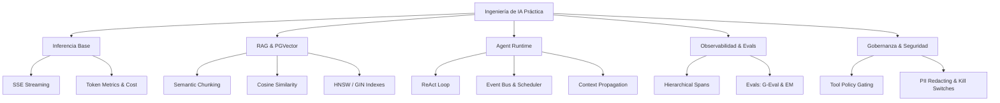

# Introducción a la Ingeniería de IA (AI Engineering)

Bienvenido a la serie de guías del **AI Engineering Lab**. Esta documentación está diseñada bajo un enfoque de **primeros principios (first-principles)**. Inspirados en la filosofía de enseñanza de Andrej Karpathy, nuestro objetivo es desmitificar los componentes mágicos de la Inteligencia Artificial y entenderlos desde su nivel más bajo: el código.

En lugar de delegar el comportamiento del sistema a librerías comerciales pesadas (los llamados "harnesses" o frameworks de agentes), aquí construimos las primitivas desde cero en Python puro, sin dependencias externas. Esto nos permite entender los detalles finos de la red (HTTP/SSE), el álgebra lineal (similitud vectorial), la concurrencia (colas y eventos) y la seguridad de sistemas (políticas de gating).

---

## 🧠 Lineamientos de Karpathy para el Desarrollo con IA

En este laboratorio no solo seguimos la pedagogía de Andrej Karpathy (construcción desde primeros principios y código legible sin dependencias), sino que también aplicamos estrictamente sus **directrices para el desarrollo asistido por IA (AI Coding Guidelines)**.

Estas directrices fueron formuladas para evitar la "complejidad accidental" y la "entropía de código" que suelen generar los agentes autónomos de codificación al operar sin restricciones:

### 1. Pensar antes de Codificar (Think Before Coding / Think First)
*   **Sin suposiciones silenciosas**: Todas las suposiciones técnicas o arquitectónicas deben formularse y acordarse de forma explícita antes de modificar el código.
*   **Explicar las compensaciones (Trade-offs)**: Si una tarea admite múltiples interpretaciones o soluciones, el agente debe presentar las opciones con sus ventajas y desventajas en lugar de tomar una decisión en silencio.
*   **Gestionar la confusión**: Si los requisitos son ambiguos o contradictorios, el agente debe detenerse y solicitar aclaraciones en lugar de adivinar el camino.

### 2. Simplicidad Primero (Simplicity First)
*   **Código mínimo**: Proporcionar la menor cantidad de código necesaria para resolver el problema actual.
*   **Cero abstracciones especulativas**: Evitar envoltorios (*wrappers*), interfaces o pre-optimizaciones que busquen dar "flexibilidad para el futuro" si no han sido requeridas formalmente.
*   **Evitar la sobre-ingeniería**: Someter cada cambio a la pregunta: *"¿Diría un ingeniero principal que esto es innecesariamente complejo?"*.

### 3. Cambios Quirúrgicos (Surgical Changes)
*   **Ediciones enfocadas**: Modificar estrictamente lo necesario para cumplir con el objetivo de la tarea.
*   **Respetar el entorno**: No "mejorar" ni refactorizar código adyacente, comentarios o dar formato al azar, a menos que esté explícitamente planificado.
*   **Homogeneidad estética**: Mimetizar el estilo, convenciones de nombres y diseño del código preexistente, priorizando la consistencia del repositorio por encima del gusto personal.

### 4. Criterios de Éxito Verificables (Verifiable Success Criteria)
*   **Definir la meta antes de programar**: Tener absoluta claridad sobre cuál es el comportamiento, test unitario o validación técnica que determinará que la tarea está completada con éxito.
*   **Validaciones continuas**: Ejecutar pruebas e inspecciones de regresión para garantizar que los cambios no dañen la estabilidad del sistema.

---

## 🏛️ Filosofía Arquitectónica y Perspectiva del CTO

Como arquitecto de sistemas y líder técnico, el valor de la Inteligencia Artificial no radica en construir demostraciones visuales rápidas (MVPs de juguete), sino en **transformar organizaciones completas a través de la IA**. 

### 1. Autonomía Organizacional y Bucles de Aprendizaje
El verdadero impacto de la IA generativa ocurre cuando logramos aplicar agentes, automatizaciones y pipelines de datos para:
*   Eliminar el trabajo manual repetitivo de bajo valor cognitivo.
*   Acelerar la toma de decisiones críticas basadas en datos estructurados y no estructurados.
*   Diseñar **sistemas organizacionales que aprenden**. Esto significa capturar telemetría y evaluaciones de forma continua, alimentando un ciclo de mejora donde los prompts, el contexto vectorial y los modelos se optimizan en producción.

### 2. Decisiones Tecnológicas Pragmáticas: Postgres + PGVector
En el desarrollo empresarial contemporáneo existe una tendencia exagerada a complicar la infraestructura tecnológica (complejidad accidental). Una de las decisiones más habituales es la adopción prematura de bases de datos vectoriales dedicadas (e.g., Pinecone, Milvus, Qdrant).

Para el **95% de los casos de uso empresariales**, la recomendación de arquitectura más robusta es iniciar con **PostgreSQL + la extensión PGVector**.

```
    ┌────────────────────────────────────────────────────────┐
    │              SISTEMA DE DATOS UNIFICADO                │
    │                                                        │
    │  ┌───────────────────────┐   ┌──────────────────────┐  │
    │  │  Tablas Relacionales  │   │  Vectores (HNSW)     │  │
    │  │  (Usuarios, Facturas) │   │  (Embeddings Chunks) │  │
    │  └───────────┬───────────┘   └──────────┬───────────┘  │
    │              │                          │              │
    │              └────────────┐┌────────────┘              │
    │                           ▼▼                           │
    │               [ SQL JOIN / Transacciones ]             │
    └────────────────────────────────────────────────────────┘
```

**¿Por qué PostgreSQL + PGVector?**
1.  **Operación Simplificada**: No requiere configurar, asegurar y pagar por un clúster de base de datos vectorial adicional.
2.  **Consistencia Transaccional (ACID)**: No hay retrasos de sincronización entre tu base de datos operativa y tus índices vectoriales. Si un registro se actualiza o elimina, su vector también.
3.  **Consultas Híbridas de Alto Rendimiento**: Permite hacer un simple `JOIN` SQL o un filtro `WHERE` sobre metadatos relacionales (e.g., `tenant_id`, permisos del usuario) al mismo tiempo que la búsqueda semántica por similitud coseno.
4.  **Madurez del Motor**: PostgreSQL cuenta con décadas de optimización en backups, réplicas de lectura, alta disponibilidad y esquemas de seguridad empresarial robustos.

*Solo se justifica migrar a una base vectorial dedicada cuando el volumen de embeddings supera los cientos de millones, se requieren búsquedas híbridas con motores no estructurados muy específicos, o las latencias de indexación en tiempo real lo demanden estrictamente.*

---

## 🗺️ El Paisaje de la Ingeniería de IA

La ingeniería de IA moderna no es solo "hacer prompts". Es una disciplina de ingeniería de sistemas que abarca:

1.  **Inferencia Cruda**: Comunicación HTTP con modelos (GPT, Claude, Gemini, Qwen, Llama), gestión de streams SSE, parsing sintáctico y estimación financiera en tiempo real.
2.  **RAG (Generación Aumentada por Recuperación)**: Chunking semántico, generación de embeddings, indexación espacial (HNSW) y evaluación de la calidad de recuperación.
3.  **Agent Runtimes**: Rieles de ejecución para agentes autónomos. Coordinación de memoria a corto y largo plazo, ejecución de herramientas y enrutamiento ReAct.
4.  **Observabilidad e Evaluaciones**: Trazabilidad jerárquica de llamadas asíncronas y puntuación cuantitativa del rendimiento de las respuestas.
5.  **Gobernanza y Seguridad**: Filtros de PII (información personal identificable), presupuestos financieros, control de tasa (*rate limiters*) e interruptores de emergencia a nivel de sistema.



En las siguientes guías, abordaremos cada una de estas áreas analizando el código paso a paso y entendiendo su diseño estructural.
