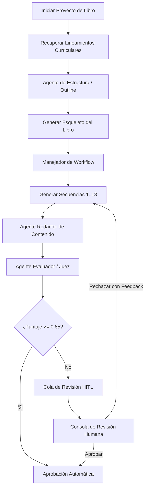

# Diseño de Sistema: Generador de Libros de Texto Asistido por IA

Este documento describe el diseño arquitectónico de un sistema basado en IA capaz de generar libros de texto para primaria (específicamente para 1° grado), alineados con lineamientos curriculares nacionales.

---

## 1. Contexto de Dominio y Requisitos

Los libros de texto de educación primaria requieren un estricto cumplimiento de estándares educativos, contenido adecuado para la edad de los estudiantes y secuencias estructuradas que los docentes puedan utilizar inmediatamente en el aula.

### Reglas de Dominio:
*   **Audiencia Objetivo**: Niñas y niños de primer grado de primaria (aproximadamente 6 años de edad). El contenido debe utilizar un vocabulario simple, oraciones cortas y ejemplos muy concretos. Las lecciones deben incluir indicaciones muy descriptivas para el soporte visual o ilustraciones.
*   **Estructura del Libro**: Cada libro se divide en **3 Trimestres**, y cada trimestre contiene **6 Secuencias Didácticas**. Una secuencia es la unidad didáctica atómica sobre la cual se trabaja.
*   **Estructura de la Secuencia Didáctica**: En la educación primaria, una secuencia pedagógica estándar consta de 3 fases obligatorias:
    1.  **Inicio (Apertura)**: Activa conocimientos previos, introduce el tema de forma motivadora y contextualiza.
    2.  **Desarrollo (Actividades)**: Entrega los conceptos principales mediante lecturas, ejercicios guiados y trabajo práctico.
    3.  **Cierre (Evaluación/Reflexión)**: Consolida el aprendizaje del día, invita a la reflexión y sugiere una evaluación sencilla.
*   **Alcance**: Una sola materia (ej. Español / Lenguajes) para un año escolar completo.
*   **Alineación Curricular**: El libro debe alinearse con objetivos curriculares específicos (competencias, estándares de aprendizaje y metas trimestrales).

---

## 2. Arquitectura de Alto Nivel

Generar un libro de texto completo (18 secuencias didácticas, con un estimado de 54 a 90 lecciones) es una tarea demasiado pesada y extensa para una sola llamada a un LLM. Para resolver esto de forma confiable, implementamos una **arquitectura de workflow híbrido**: el control del flujo (creación del esqueleto del libro $\rightarrow$ trimestres $\rightarrow$ generación de secuencias didácticas $\rightarrow$ evaluación de agentes $\rightarrow$ revisión humana) se gestiona de forma determinista mediante código, mientras que las tareas creativas de redacción y evaluación se delegan a agentes de IA especializados.



### Componentes Clave:
1.  **Workflow Orchestrator (Orquestador de Flujo)**: Gestiona tareas en segundo plano (*Background Tasks*) para coordinar la generación secuencial. Controla la máquina de estados de las secuencias: `DRAFT` $\rightarrow$ `GENERATING` $\rightarrow$ `PENDING_REVIEW` $\rightarrow$ `APPROVED` (o `REJECTED`).
2.  **Curricular Standards RAG (RAG de Lineamientos)**: Simula la recuperación semántica de los requisitos de estudio nacionales según la asignatura y el tema actual, inyectándolos en la ventana de contexto del agente redactor.
3.  **Agentes de PydanticAI**:
    *   **Outline Agent (Agente de Estructura)**: Diseña la macro-estructura del libro (3 trimestres, 18 secuencias didácticas con sus títulos y objetivos de aprendizaje específicos).
    *   **Content Generator Agent (Agente Redactor)**: Redacta el contenido de las lecciones bajo la estructura obligatoria de *Inicio, Desarrollo y Cierre*, asegurando un lenguaje comprensible para niños de 6 años.
    *   **Evaluation Agent (Agente Juez)**: Analiza el texto generado y califica de 0.00 a 1.00 la alineación con los estándares nacionales y la adecuación pedagógica/etaria, entregando justificaciones estructuradas.
4.  **Human-in-the-Loop (HITL) Queue**: Una cola persistida en base de datos. Si una secuencia didáctica no supera la auditoría de calidad automática (puntuación menor a 0.85), se detiene su publicación y se envía a esta cola de revisión para que un docente/pedagogo la apruebe o la rechace aportando retroalimentación.

---

## 3. Esquema de Base de Datos

Utilizamos un diseño relacional en SQLite para estructurar la jerarquía del libro de texto y realizar la trazabilidad del pipeline de generación:

```
  +------------------+         +------------------+         +------------------+
  |    Textbook      |         |    Trimestre     |         |    Secuencia     |
  +------------------+         +------------------+         +------------------+
  | id (PK)          |1       *| id (PK)          |1       *| id (PK)          |
  | title            |-------->| textbook_id (FK) |-------->| trimestre_id (FK)|
  | subject          |         | number (1-3)     |         | number (1-6)     |
  | grade            |         | title            |         | title            |
  | status           |         | goals            |         | objectives       |
  | created_at       |         +------------------+         | alignment_score  |
  +------------------+                                      | age_score        |
                                                            | status           |
                                                            | review_feedback  |
                                                            +------------------+
                                                                     | 1
                                                                     |
                                                                     v *
                                                            +------------------+
                                                            |      Lesson      |
                                                            +------------------+
                                                            | id (PK)          |
                                                            | secuencia_id (FK)|
                                                            | number           |
                                                            | title            |
                                                            | section_inicio   |
                                                            | section_desarrol |
                                                            | section_cierre   |
                                                            | activities       |
                                                            +------------------+
```

---

## 4. Ingeniería de Contexto y Ruteo de Modelos

Aplicamos las mejores prácticas para optimizar el comportamiento de los agentes cognitivos:
*   **Mitigación de "Lost in the Middle"**: Los requisitos curriculares inyectados al contexto se ordenan por relevancia semántica, colocando los más críticos al principio del bloque de datos y las instrucciones operativas al final de la ventana de contexto.
*   **Structured Outputs (Salidas Estructuradas)**: Usamos esquemas de Pydantic para garantizar que la estructura del libro ( trimestres y secuencias), las 3 secciones pedagógicas por lección y los reportes de auditoría cumplan exactamente con los tipos de datos requeridos por la aplicación.
*   **Model Routing (Enrutamiento de Modelos)**:
    *   *Tareas simples* (como la categorización de lineamientos o el formateo rápido): Ruteadas a modelos costo-eficientes (`gemini-1.5-flash`).
    *   *Generación compleja y evaluación*: Ruteadas a modelos de mayor capacidad de razonamiento (`gemini-2.0-flash` o `gemini-1.5-pro` según disponibilidad).

---

## 5. Capas de Clean Architecture

El código está estructurado siguiendo los principios de **Arquitectura Hexagonal (Puertos y Adaptadores)**, desacoplando la lógica de negocio de los detalles tecnológicos de persistencia y APIs de modelos de lenguaje:

1.  **Domain (Dominio)**: Contiene las entidades puras de negocio (`Textbook`, `Lesson`, etc.) y las interfaces abstractas (puertos) que definen cómo se almacena la información (`TextbookRepository`) y cómo actúan los agentes (`TextbookAgentService`). No tiene dependencias de librerías externas.
2.  **Application (Aplicación)**: Implementa los casos de uso (`CreateTextbookUseCase`, `GenerateBookWorkflowUseCase`, `ReviewSequenceUseCase`) aplicando la lógica del flujo de negocio y coordinando las operaciones a través de los puertos inyectados.
3.  **Infrastructure (Infraestructura)**: Contiene los adaptadores tecnológicos específicos. Esto incluye la persistencia en base de datos utilizando SQLAlchemy ORM, la implementación de agentes usando **PydanticAI**, los controladores endpoints de **FastAPI** y el dashboard web construido en vainilla HTML/CSS/JS.

---

## 6. Validación de Calidad y Guardrails

El sistema ejecuta dos auditorías automatizadas al finalizar la generación de cada secuencia:
1.  **Filtro de Vocabulario**: Analiza sintácticamente la complejidad de las oraciones para verificar que se adecúen a una lectura de primer grado (niños de 6 años).
2.  **LLM-as-a-Judge (Evaluación por Agente)**: Un agente independiente actúa como juez evaluando:
    *   *Alineación Curricular*: ¿Las actividades cubren directamente los lineamientos curriculares inyectados?
    *   *Metodología Pedagógica*: ¿Se estructuran adecuadamente las fases de Inicio, Desarrollo y Cierre?
    *   *Adecuación de Edad*: ¿Las dinámicas y el vocabulario son apropiados para el desarrollo cognitivo de niños de 6 años?

Si cualquiera de estas dos métricas cae por debajo del 85% (**0.85/1.00**), la secuencia se marca automáticamente como `PENDING_REVIEW` y se deriva a la cola de revisión humana.

---

## 7. Análisis Arquitectónico Profundo y Registro de Decisiones (ADRs)

Para garantizar un sistema de alto rendimiento, mantenible y financieramente viable en producción, se evaluaron tres decisiones de diseño críticas: el framework de agentes, la base de datos de soporte RAG y la estrategia de cache.

### ADR-001: PydanticAI vs. LangChain / LangGraph

#### Contexto
Necesitamos un framework de orquestación cognitiva que administre las llamadas estructuradas al LLM y garantice la conformidad de los contratos de datos en la generación de libros.

#### Matriz Comparativa

| Criterio | PydanticAI | LangChain / LangGraph |
| :--- | :--- | :--- |
| **Tipado Estático** | Nativo. Totalmente integrado con chequeadores de tipo estáticos y Pydantic. | Tipado dinámico usando wrappers de mensajes complejos (LCEL). |
| **Complejidad Accidental** | Mínima. Es un wrapper ligero; las excepciones muestran stack traces estándar y fáciles de depurar. | Alta. Los errores suelen quedar enterrados bajo decenas de clases abstractas del framework. |
| **Validación Estructural** | Nativa. Valida los esquemas de salida (`output_type`) usando Pydantic bajo el capó. | Requiere parsers manuales o librerías adicionales (e.g. Instructor). |
| **Control del Flujo** | Loops estructurados en Python (ideal para flujos deterministas secuenciales). | Grafos de estado (óptimo para flujos cíclicos complejos). |

#### Justificación y Decisión
Elegimos **PydanticAI** por las siguientes razones:
1.  **Evitar el "Complexity Tax"**: LangChain introduce abstracciones pesadas que dificultan el mantenimiento. PydanticAI proporciona una DX (Developer Experience) muy fluida al permitir programar flujos con sintaxis Python estándar.
2.  **Alineación con Clean Architecture**: Dado que nuestro núcleo utiliza Pydantic para el modelado de datos de dominio, PydanticAI se integra de forma directa sin necesidad de escribir capas de transformación de datos adicionales.
3.  **Estructura del Workflow**: La generación de libros de texto es una **jerarquía determinista lineal** (Libro $\rightarrow$ Trimestre $\rightarrow$ Secuencia $\rightarrow$ Lección). No requiere de ciclos complejos, bucles infinitos ni handoffs autónomos entre múltiples agentes que justifiquen la sobrecarga de Grafos de Estado en LangGraph.

---

### ADR-002: SQLite vs. Base de Datos Vectorial Dedicada (pgvector / Qdrant)

#### Contexto
Debemos indexar y recuperar lineamientos curriculares oficiales para guiar el proceso de generación semántica.

#### Matriz Comparativa

| Criterio | SQLite (Búsqueda Relacional/FTS) | pgvector / Qdrant (Base Vectorial) |
| :--- | :--- | :--- |
| **Sobrecarga Operativa** | Nula. Base de datos embebida auto-contenida en un solo archivo. | Alta. Requiere desplegar clústeres dedicados, respaldos e infraestructura. |
| **Volumen de Datos** | Ideal para escalas pequeñas y medianas (<10,000 lineamientos). | Necesario para millones de documentos masivos. |
| **Consistencia de Datos** | Transacciones ACID nativas; comparte hilos con las tablas operativas. | Consistencia eventual; requiere pipelines de sincronización. |
| **Precisión de Búsqueda** | Precisión absoluta mediante filtros estructurados (`Asignatura`, `Grado`). | Similitud semántica aproximada; puede incluir falsos positivos. |

#### Justificación y Decisión
Elegimos **SQLite** como motor relacional estructurado para la inyección curricular:
1.  **Escala del Dominio**: El conjunto de lineamientos curriculares correspondientes a un grado y asignatura específicos es extremadamente acotado (menor a 100 registros). Cargar y buscar estos datos en una base de datos vectorial dedicada añade latencia de red innecesaria y costos de nube elevados.
2.  **Límites Transaccionales**: Al unificar los lineamientos curriculares y las entidades operativas del libro en un mismo motor de persistencia, evitamos la inconsistencia de datos y simplificamos los respaldos del sistema.
3.  **Camino de Escalado**:
    *   *Escala actual/mediana*: Búsquedas exactas usando filtros SQL relacionales (e.g. `subject = 'Español' AND grade = 1`) y búsquedas de texto clásicas (FTS) resuelven la recuperación con latencias de microsegundos.
    *   *Escala global/multilingüe*: Si el sistema escala para administrar millones de lineamientos curriculares internacionales en varios idiomas, migraremos hacia **PostgreSQL + pgvector**. Esto mantendrá las consultas híbridas relacionales y vectoriales unificadas bajo el mismo motor ACID, sin incurrir en el desacoplamiento de una base de datos vectorial dedicada.

---

### ADR-003: Estrategia de Caching en Producción

#### Contexto
La generación por agentes cognitivos consume un volumen alto de tokens y tiene latencias de procesamiento considerables. Debemos optimizar tiempos y costos financieros.

#### El Dilema: ¿Por qué no cachear las lecciones generadas?
**No cacheamos el contenido de las lecciones** asociadas al tema. Cargar desde cache una lección idéntica cuando se solicita el mismo tema genera dos problemas graves de producto:
1.  **Pérdida de Personalización y Plagio**: Si dos escuelas distintas solicitan generar un libro sobre el mismo tema, recibirán exactamente el mismo texto e ilustraciones. Deseamos que el LLM utilice su temperatura de inferencia para producir ejercicios únicos y diversos en cada ejecución.
2.  **Persistencia de Errores**: Si una lección se generó originalmente con un error o alucinación leve, el caché persistirá el error para todos los usuarios futuros sin dar oportunidad a que una nueva llamada de inferencia y evaluación corrija el texto.

#### Arquitectura de Caching Propuesta para Producción
En lugar de cachear las salidas creativas de los agentes, aplicamos caching en las capas de **ingesta y de contexto**:

```
[Consulta del Usuario] 
      │
      ▼
[RAG de Lineamientos Curriculares] ──► [Caché en RAM Local (Redis)] (Evita lecturas a disco de lineamientos estáticos)
      │
      ▼
[Llamada al LLM (Gemini API)] ───────► [Gemini Context Caching] (Mantiene en memoria los lineamientos inyectados)
      │
      ▼
[Generación Creativa en Vivo]
```

1.  **LLM Context Caching (Caché de Contexto en Proveedor)**:
    Dado que las secuencias didácticas de un mismo libro se generan de manera consecutiva e inyectan el mismo conjunto de lineamientos curriculares nacionales en el system prompt, utilizamos **context caching** (provisto de forma nativa por la API de Gemini). El proveedor de IA mantiene los tokens de lineamientos en la caché de su servidor de inferencia. Las llamadas subsecuentes solo pagan la diferencia de tokens y reducen el TTFT (tiempo al primer token) de segundos a milisegundos, reduciendo la factura de tokens en hasta un **80%**.
2.  **Caché de Metadatos en RAM (Redis / Memoria local)**:
    Los lineamientos curriculares nacionales son estáticos (no cambian durante el ciclo escolar). Los cacheamos en la RAM del servidor de backend para evitar consultas innecesarias a la base de datos de SQLite.
